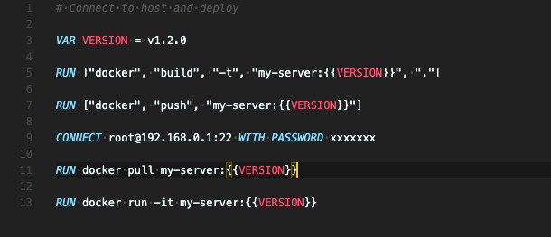

English | [中文简体](README_zh-CN.md)

<div align="center">

## Travel back and forth between local and remote workflow

[](https://github.com/axetroy/s4/actions)
[](https://coveralls.io/github/axetroy/s4?branch=master)
[](https://goreportcard.com/report/github.com/axetroy/s4)




</div>

Features:

- [x] Cross-platform support
- [x] Declarative workflow
- [x] Upload local files to remote
- [x] Download remote files to local
- [x] Execute commands on the remote server

### Usage

step 1: create a file name `.s4`

```s4
CONNECT root@192.168.0.1:22

RUN ls -lh
```

step 2: run the following command

```bash
> s4
[Step 1]: CONNECT root@192.168.0.1:22
? Please type remote server's password **********
[Step 2]: RUN ls -lh
total 20K
drwxr-xr-x  4 root root 4.0K Mar 15 10:10 test1
drwxr-xr-x  2 root root 4.0K Sep 23  2018 test2
drwxr-xr-x  6 root root 4.0K Sep 23  2018 test3
drwxr-xr-x  4 root root 4.0K Aug 27 16:25 test4
```

for more detail about the command. print `s4 --help`

### Documentation

| Syntax   | Description                                                              | Example                                                                           |
| -------- | ------------------------------------------------------------------------ | --------------------------------------------------------------------------------- |
| CONNECT  | Connect to the server.                                                   | `CONNECT root@192.168.0.1:22`<br/>`CONNECT root@192.168.0.1:22 WITH PASSWORD 123` |
| ENV      | Setting environment variables for remote server.                         | `ENV PRIVATE_KEY = 123`                                                           |
| VAR      | Defining variables.                                                      | `VAR PRIVATE_KEY = 123`<br/>`RUN echo {{PRIVATE_KEY}}`                            |
| CD       | Change current working directory of remote server.                       | `CD /home/axetroy`                                                                |
| UPLOAD   | Upload local files to remote server dir.                                 | `UPLOAD local_file.txt ./remote_dir`                                              |
| DOWNLOAD | Download remote files to local dir.                                      | `DOWNLOAD remote_file.txt ./local_dir`                                            |
| COPY     | Copy file at remote server.                                              | `COPY remote.db remote.db.bak`                                                    |
| MOVE     | Move file at remote server.                                              | `MOVE remote.bak remote.db`                                                       |
| DELETE   | Delete files at remote server.                                           | `DELETE remote_file_1.txt remote_file_2.txt`                                      |
| RUN      | Run command at local machine or remote server.                           | `RUN echo "run at remote"`<br/>`RUN ["echo", "\"run at local\""]`                 |
| TRY      | Same as RUN, but will proceed to the next step regardless of the results | `TRY exit 1`<br/>`RUN ls -lh`                                                     |

<details><summary>CONNECT</summary>

Connect to remote SSH server. Its format should be `<username>@<address>:<port> [WITH [PASSWORD|FILE] [VALUE]]`

eg `CONNECT root@192.168.0.1:22`

eg `CONNECT root@192.168.0.1:22 WITH PASSWORD you_password`

eg `CONNECT root@192.168.0.1:22 WITH FILE ./path/to/private/key/file`

If the password or private key file not provide. it will ask you to enter in terminal.

</details>

<details><summary>ENV</summary>

Set environmental variable for `RUN` command

eg `ENV PRIVATE_KEY = 123`

</details>

<details><summary>VAR</summary>

Defining variables. It has 3 ways to define it.

### Set string literals

Its format is this `VAR {key} = {value}`

```s4
VAR PRIVATE_KEY = 123

RUN echo {{PRIVATE_KEY}}
```

### Set environmental variable

Its format is this `VAR {key} = ${envKey}:{tag}`

`tag` can be `local`/`remote`. Used to specify to get local/remote environment variables.

```s4
CONNECT root@192.168.0.1:22

VAR GOPATH_LOCAL = $GOPATH:local

VAR GOPATH_REMOTE = $GOPATH:remote

RUN echo "remote GOPATH: {{GOPATH_REMOTE}}, local GOPATH: {{GOPATH_LOCAL}}"
```

### Set stdout from executing the command line

Its format is this `VAR {key} <= {bashCommand}`.

This will execute command at remote and set stdout to a variable.

or use the format `VAR {key} <= ["{command}", "{argument1}", "{argument2}"]`. It will run in local.

```s4
VAR NODE_VERSION_LOCAL <= ["node", "-v"]

VAR NODE_VERSION_REMOTE <= node -v

RUN echo "remote version: {{NODE_VERSION_REMOTE}}, local version: {{NODE_VERSION_LOCAL}}"
```

```s4
VAR PRIVATE_KEY = 123
ENV PRIVATE_KEY = {{PRIVATE_KEY}}
RUN echo {{PRIVATE_KEY}}
```

</details>

<details><summary>CD</summary>

Change the current working directory of the remote server

eg `CD /home/axetroy`

If the directory does not exist, an error will be thrown

This will affect all operations on the remote server, including upload/download/run commands, etc.

</details>

<details><summary>UPLOAD</summary>

Upload local files to a remote server

eg `UPLOAD start.py ./server`

It required at least two parameters. The last parameter is the remote server's directory where should be uploaded.

The rest of the parameters are the local files path.

</details>

<details><summary>DOWNLOAD</summary>

Download remote files to local

eg `DOWNLOAD start.py ./server`

It required at least two parameters. The last parameter is the local directory where should be downloaded.

The rest of the parameters are remote files path.

</details>

<details><summary>COPY</summary>

Copy file at the remote server

eg `COPY data.db data.db.bak`

</details>

<details><summary>MOVE</summary>

Move file at the remote server

eg `MOVE data.db data.db.bak`

</details>

<details><summary>DELETE</summary>

Delete files at the remote server, for security, Linux dangerous directories will be ignored

eg `DELETE file1 file2`

</details>

<details><summary>RUN</summary>

Run the command at the local or remote server

#### Run at the remote server

eg `RUN python ./remote/start.py`

It supports multi-line wrap

```s4
# run at remote
RUN npm version \
    && npm run build \
    && npm run test \
    && npm run publish
```

### Run at the local machine

```s4
# run at local machine
RUN ["npm", "run", "build"]
```

</details>

<details><summary>TRY</summary>

Same as RUN, but will proceed to the next step regardless of the results

</details>

### Installation

Download the executable file for your platform at [release page](https://github.com/axetroy/s4/releases)

Then set the environment variable.

eg, the executable file is in the `~/bin` directory.

```bash
# ~/.bash_profile
export PATH="$PATH:~/bin"
```

finally, try it out.

```bash
s4 --help
```

### Upgrade

You can re-download the executable and overwrite the original file.

or type the following command to upgrade to the latest version.
VAR

```bash
> s4 upgrade
```

### Build from source code

```bash
> go get -v -u github.com/axetroy/s4
> cd $GOPATH/src/github.com/axetroy/s4
> make build
```

### Test

```bash
make test
```

### Why?

> Why do I need such a tool?
> What is its use?

In development, we need to operate remote servers locally, such as deploying services, restarting services, upload files, etc.

of course, We can do this with a bash script.

But that is quite cumbersome.

So, I wrote this tool to release my hands.

I hope this helps you.

### Tools

[vscode-s4](https://github.com/axetroy/vscode-s4)

### License

The [MIT License](https://github.com/axetroy/s4/blob/master/LICENSE)
