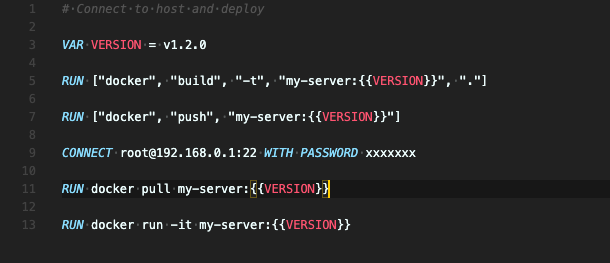

[English](README.md) | 中文简体

<div align="center">

## 在本地和远程工作流之间来回穿行

[](https://github.com/axetroy/s4/actions)
[](https://coveralls.io/github/axetroy/s4?branch=master)
[](https://goreportcard.com/report/github.com/axetroy/s4)




</div>

特性:

- [x] 跨平台支持
- [x] 声明式工作流
- [x] 上传文件到远程
- [x] 下载文件到本地
- [x] 在远程服务器执行命令

### 使用方法

步骤 1: 创建一个名为 `.s4` 的文件

```s4
CONNECT root@192.168.0.1:22

RUN ls -lh
```

步骤 2: 运行一下命令

```bash
> s4
[Step 1]: CONNECT root@192.168.0.1:22
? Please type remote server's password **********
[Step 2]: RUN ls -lh
total 20K
drwxr-xr-x  4 root root 4.0K Mar 15 10:10 test1
drwxr-xr-x  2 root root 4.0K Sep 23  2018 test2
drwxr-xr-x  6 root root 4.0K Sep 23  2018 test3
drwxr-xr-x  4 root root 4.0K Aug 27 16:25 test4
```

更多详情信息. 请输入 `s4 --help`

### 文档

| 语法     | 描述                                              | 例子                                                                              |
| -------- | ------------------------------------------------- | --------------------------------------------------------------------------------- |
| CONNECT  | 连接到远程服务器                                  | `CONNECT root@192.168.0.1:22`<br/>`CONNECT root@192.168.0.1:22 WITH PASSWORD 123` |
| ENV      | 设置远程的环境变量                                | `ENV PRIVATE_KEY = 123`                                                           |
| VAR      | 定义变量                                          | `VAR PRIVATE_KEY = 123`<br/>`RUN echo {{PRIVATE_KEY}}`                            |
| CD       | 改变服务器的当前工作目录                          | `CD /home/axetroy`                                                                |
| UPLOAD   | 上传文件到远程服务器                              | `UPLOAD local_file.txt ./remote_dir`                                              |
| DOWNLOAD | 从远程服务器中下载文件到本地                      | `DOWNLOAD remote_file.txt ./local_dir`                                            |
| COPY     | 在远程服务器上复制文件                            | `COPY remote.db remote.db.bak`                                                    |
| MOVE     | 在远程服务器上移动文件                            | `MOVE remote.bak remote.db`                                                       |
| DELETE   | 删除远程服务器上的文件                            | `DELETE remote_file_1.txt remote_file_2.txt`                                      |
| RUN      | 在本地/远程服务器运行命令                         | `RUN echo "run at remote"`<br/>`RUN ["echo", "\"run at local\""]`                 |
| TRY      | 与 RUN 相同, 但是无论命令运行得如何都会进行下一步 | `TRY exit 1`<br/>`RUN ls -lh`                                                     |

<details><summary>CONNECT</summary>

连接远程服务器。 它的格式应该是这样 `<username>@<address>:<port> [WITH [PASSWORD|FILE] [VALUE]]`

eg `CONNECT root@192.168.0.1:22`

eg `CONNECT root@192.168.0.1:22 WITH PASSWORD you_password`

eg `CONNECT root@192.168.0.1:22 WITH FILE ./path/to/private/key/file`

如果没有提供密码或者密钥文件， 那么程序会在终端询问输入密码

</details>

<details><summary>ENV</summary>

为远程命令 `RUN` 设置环境变量

eg `ENV PRIVATE_KEY = 123`

</details>

<details><summary>VAR</summary>

定义变量。 这里有 3 中方式定义变量。

### 直接赋值

它的格式是 `VAR {key} = {value}`

```s4
VAR PRIVATE_KEY = 123

RUN echo {{PRIVATE_KEY}}
```

### 从环境变量读取

它的格式是这样 `VAR {key} = ${envKey}:{tag}`

`tag` 可以是 `local`/`remote`. 用于指定获取 本地/远程 的变量变量

```s4
CONNECT root@192.168.0.1:22

VAR GOPATH_LOCAL = $GOPATH:local

VAR GOPATH_REMOTE = $GOPATH:remote

RUN echo "remote GOPATH: {{GOPATH_REMOTE}}, local GOPATH: {{GOPATH_LOCAL}}"
```

### 从命令的 stdout 中读取

它的格式是这样 `VAR {key} <= {bashCommand}`.

它会在远程服务器执行命令，并且把它的 stdout 作为变量的值

或者使用这种格式 `VAR {key} <= ["{command}", "{argument1}", "{argument2}"]` 运行本地命令

```s4
VAR NODE_VERSION_LOCAL <= ["node", "-v"]

VAR NODE_VERSION_REMOTE <= node -v

RUN echo "remote version: {{NODE_VERSION_REMOTE}}, local version: {{NODE_VERSION_LOCAL}}"
```

```s4
VAR PRIVATE_KEY = 123
ENV PRIVATE_KEY = {{PRIVATE_KEY}}
RUN echo {{PRIVATE_KEY}}
```

</details>

<details><summary>CD</summary>

更改远程服务器的当前工作目录

eg `CD /home/axetroy`

如果目录不存在，则会抛出异常

它会影响所有的关于远程服务器的操作，包括 上传文件/下载文件/运行命令 等

</details>

<details><summary>UPLOAD</summary>

上传本地文件到远程服务器

eg `UPLOAD start.py ./server`

它需要至少两个参数。 最后一个参数是远程服务器上，最终上传到的目录路径

其余的参数为本地文件路径

</details>

<details><summary>DOWNLOAD</summary>

下载远程服务器的文件到本地

eg `DOWNLOAD start.py ./server`

它需要至少两个参数。 最后一个参数是本地机器，最终下载到的目录路径

其余的参数为远程服务器文件路径

</details>

<details><summary>COPY</summary>

在远程服务器复制文件

eg `COPY data.db data.db.bak`

</details>

<details><summary>MOVE</summary>

在远程服务器移动文件

eg `MOVE data.db data.db.bak`

</details>

<details><summary>DELETE</summary>

删除远程服务器的文件。为了安全考虑，Linux 系统级的目录不允许被删除

eg `DELETE file1 file2`

</details>

<details><summary>RUN</summary>

在 本地/远程服务器 上运行命令

#### 在远程服务器上运行

eg `RUN python ./remote/start.py`

支持多行换行

```s4
# run at remote
RUN npm version \
    && npm run build \
    && npm run test \
    && npm run publish
```

#### 在本机上运行

```s4
# run at local machine
RUN ["npm", "run", "build"]
```

</details>

<details><summary>TRY</summary>

与 RUN 相同, 但是无论命令运行得如何都会进行下一步

</details>

### 安装

在 [release page](https://github.com/axetroy/s4/releases) 页面下载你平台相关的可执行文件

然后设置环境变量

例如, 可执行文件放在 `~/bin` 目录

```bash
# ~/.bash_profile
export PATH="$PATH:~/bin"
```

最后，试一下是否设置正确

```bash
s4 --help
```

### 升级

你可以重新下载可执行文件然后覆盖

或者输入一下命令进行升级到最新版

```bash
> s4 upgrade
```

### 从源码构建

```bash
> go get -v -u github.com/axetroy/s4
> cd $GOPATH/src/github.com/axetroy/s4
> make build
```

### 测试

```bash
make test
```

### Q & A?

> 为什么我需要用这个工具?
> 这个工具有什么用?

在开发中，我们需要在本地操作远程服务器，例如部署服务，重新启动服务，上传文件等。

当然，我们可以使用 bash 脚本来做到这一点。

但这很麻烦。

因此，我编写了此工具来释放自己的双手。

我希望这可以帮助你。

### 工具链

[vscode-s4](https://github.com/axetroy/vscode-s4)

### 开源许可

The [MIT License](https://github.com/axetroy/s4/blob/master/LICENSE)
